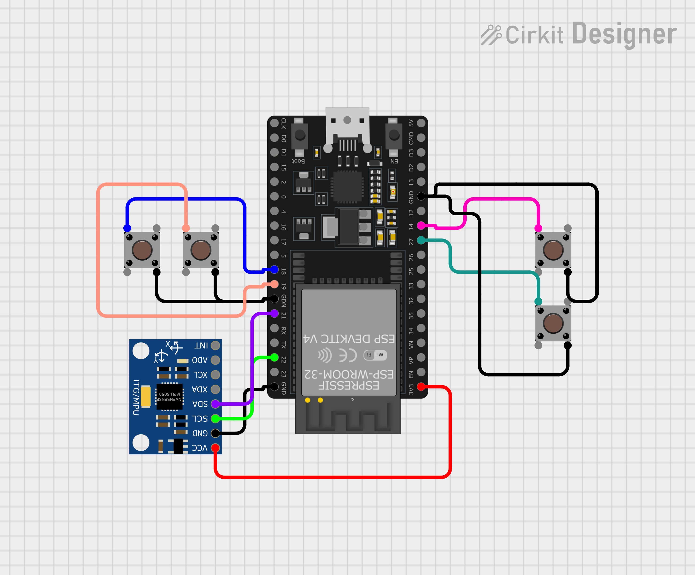

# 🖱️ ESP32 BLE Air Mouse

Transform your ESP32 and MPU6050 into a sleek, motion-controlled Bluetooth mouse. This project uses the built-in Bluetooth Low Energy (BLE) capabilities of the ESP32 to act as a standard HID (Human Interface Device), allowing you to control your computer cursor simply by moving your hand in the air.



## ✨ Features

- **🎮 Motion Control**: High-precision cursor movement using the MPU6050 gyroscope.
- **⚡ Dynamic Sensitivity**: Cursor speed scales naturally with your hand movement (faster movement = faster cruise).
- **🎯 Deadzone Filtering**: Intelligent thresholding to prevent cursor "creep" or jitter when stationary.
- **🖱️ Full Mouse Functionality**:
  - Left & Right Click buttons.
  - Dedicated Scroll Up & Scroll Down buttons.
- **📡 Wireless & Driverless**: Uses standard BLE HID profiles. No software installation required on the host computer.
- **🔋 Energy Efficient**: Built using Bluetooth Low Energy for longer battery life in portable setups.

## 🛠️ Hardware Requirements

- **Microcontroller**: [ESP32 DevKit V4](https://www.espressif.com/en/products/devkits/esp32-devkitc) (or any ESP32 with BLE support).
- **Sensor**: [MPU6050](https://www.adafruit.com/product/3803) (6-axis Accel + Gyro).
- **Buttons**: 4x Momentary Push Buttons.
- **Power**: USB-C/Micro-USB or a 3.7V LiPo battery.

## 🔌 Wiring Diagram

| Component | ESP32 Pin | Description |
| :--- | :--- | :--- |
| **MPU6050 VCC** | 3V3 | Power |
| **MPU6050 GND** | GND | Ground |
| **MPU6050 SCL** | GPIO 22 | I2C Clock |
| **MPU6050 SDA** | GPIO 21 | I2C Data |
| **Left Click** | GPIO 18 | Internal Pull-up |
| **Right Click** | GPIO 19 | Internal Pull-up |
| **Scroll Up** | GPIO 14 | Internal Pull-up |
| **Scroll Down** | GPIO 27 | Internal Pull-up |

*Note: All buttons should be connected between the GPIO pin and GND.*

## 🚀 Getting Started

### 1. Prerequisites
Ensure you have the [Arduino IDE](https://www.arduino.cc/en/software) installed with the ESP32 board support package.

### 2. Install Libraries
You will need to install the following libraries via the Arduino Library Manager:
- `ESP32-BLE-Mouse` by T-vK
- `Adafruit MPU6050`
- `Adafruit Unified Sensor`

### 3. Flash the Code
1. Open `Air_Mouse.ino` in Arduino IDE.
2. Select your ESP32 board (e.g., "DOIT ESP32 DEVKIT V1").
3. Connect your ESP32 and click **Upload**.

### 4. Pair & Play
- Once flashed, open "Bluetooth & other devices" on your PC/Mac/Tablet.
- Search for a new device named **"ESP32 BLE Mouse"**.
- Connect and start waving!

## 🧪 Technical Logic

The project uses the **Gyroscope (degrees/sec)** instead of the Accelerometer to map movement. This provides a "laser pointer" feel.
- **Yaw (Z-axis)** -> Horizontal Movement (X)
- **Pitch (Y-axis)** -> Vertical Movement (Y)

```cpp
// Dynamic sensitivity formula
float dynamicSensitivity = baseSensitivity * (1 + speed * 0.2);
```

## 📜 License
This project is open-source and available under the [MIT License](LICENSE).

---
*Developed by [Naman Pahariya](https://github.com/NamanPahariya) with ❤️ for the Microcontroller community.*
